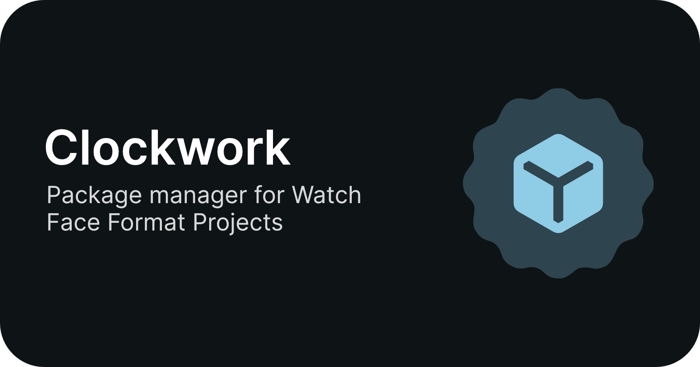

# Clockwork

Clockwork is an open-source package manager for [Google-Samsung Watch Face Format (WFF)](https://developer.android.com/training/wearables/wff) projects. It can download reusable WFF components and build your watch face

## Documentation

Read our [documentation](https://clockwork-pkg.pages.dev/) to learn how to setup, build, and install your watch face.

<!-- ### Features

- [XML Preprocessor](https://github.com/gondwanasoft/xml-preprocessor)
- [WFF XML XSD Validator](https://github.com/google/watchface/blob/main/third_party/wff/README.md)
- [Memory footprint evaluator](https://github.com/google/watchface/tree/main/play-validations).

The script can't build signed release bundles suitable for uploading to [Google Play Console](https://play.google.com/console).

### Limitations

`build.exe` can require the `JAVA_HOME` and `ANDROID_HOME` environment variables to be set correctly. `set-env.bat` simplistically attempts to ensure this. If it fails, set the required variables manually.

`build.exe` can't build signed release bundles suitable for uploading to [Google Play Console](https://play.google.com/console). You can do this as follows:

- If you're using [XML Preprocessor](https://github.com/gondwanasoft/xml-preprocessor), use `build.exe`'s `-d` command-line option to prevent deletion of `watchface.xml`.

- In _Android Studio_, select `Build` > `Build App Bundle(s) / APK(s)` > `Build Bundle(s)`. This should create `watchface\release\watchface-release.aab`. This should be acceptable to [Google Play Console](https://play.google.com/console) if you use _Google Play_ to sign the release.

`build.exe` has only been tested in an environment with _Android Studio_ installed. If you don't want _Android Studio_:

- Any text editor can be used to edit the XML and config files. _Visual Studio Code_ is recommended.

- Instead of using gradle directly, you could use the WFS-provided `bundletool`.

- `adb` is available from WFS installation (_eg_, `%LOCALAPPDATA%\Programs\WatchFaceStudio\tools\window\adb.exe`).

- Android emulators can be run independently of _Android Studio_, but it might be easier to use a real watch.

- [This site](https://nthn.uk/blog/wfs) describes an equivalent process that doesn’t require _Android Studio_. -->

## Developing Clockwork

Read our [documentation](https://clockwork-pkg.pages.dev/developers/compiling) to learn how to setup your build environment, compile Clockwork, and test Clockwork.

## Acknowledgements

- [Google's Watch Face Format Sample repository](https://github.com/android/wear-os-samples/tree/main/WatchFaceFormat)

- [Google's WFF XML XSD Validator](https://github.com/google/watchface/blob/main/third_party/wff/README.md)

- [Google's memory footprint evaluator](https://github.com/google/watchface/tree/main/play-validations)
